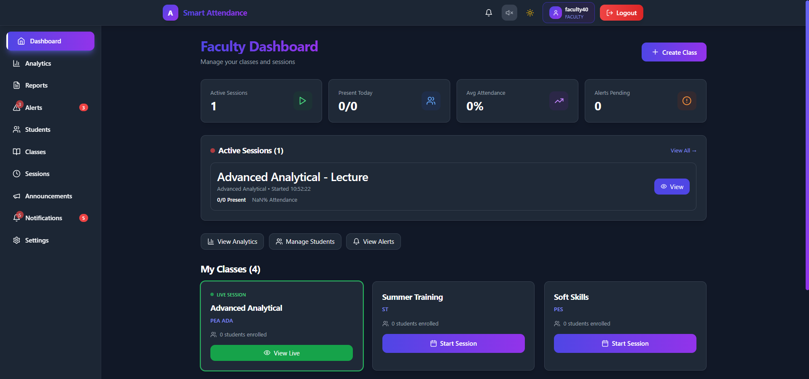
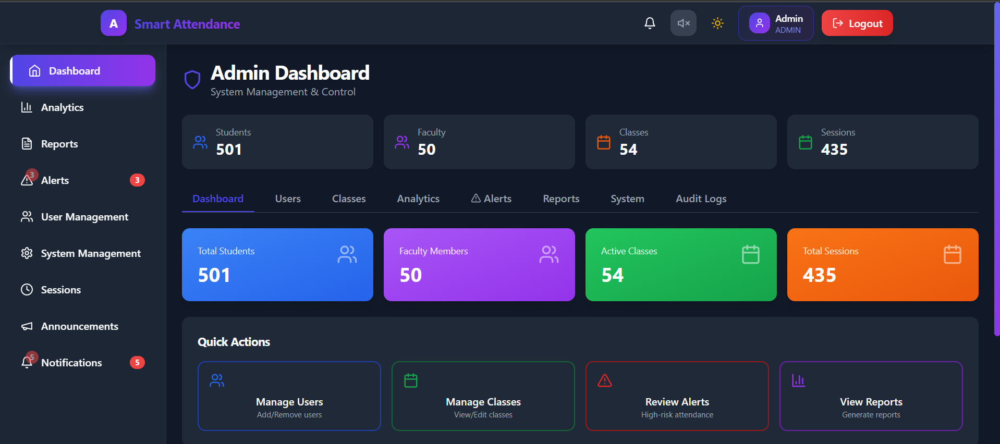
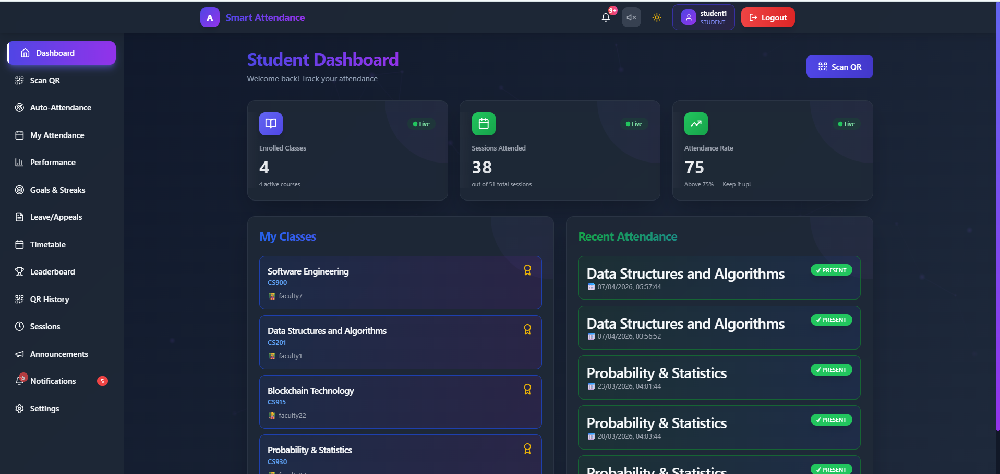
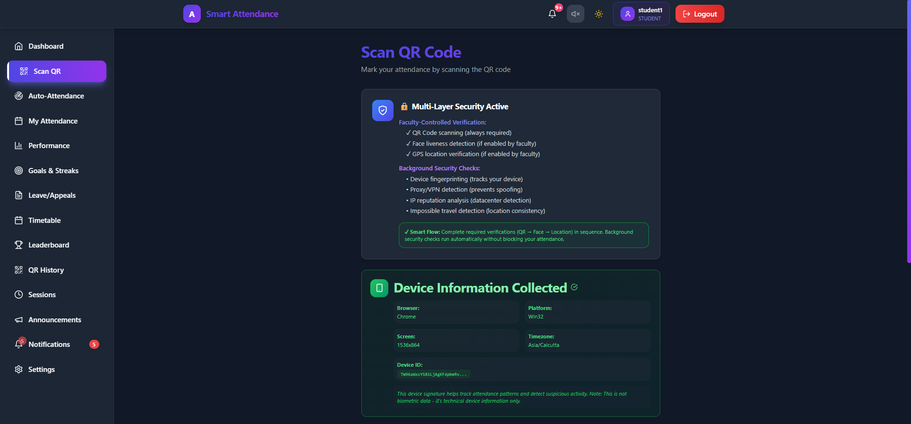
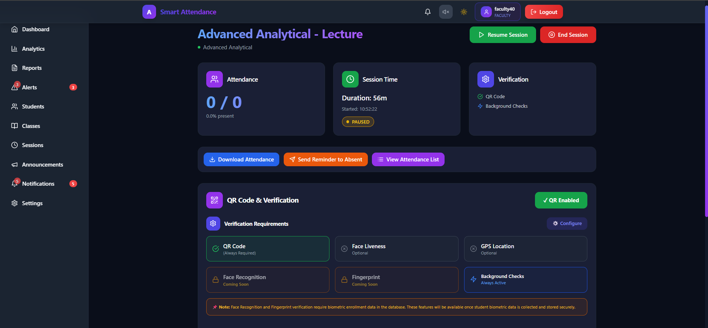
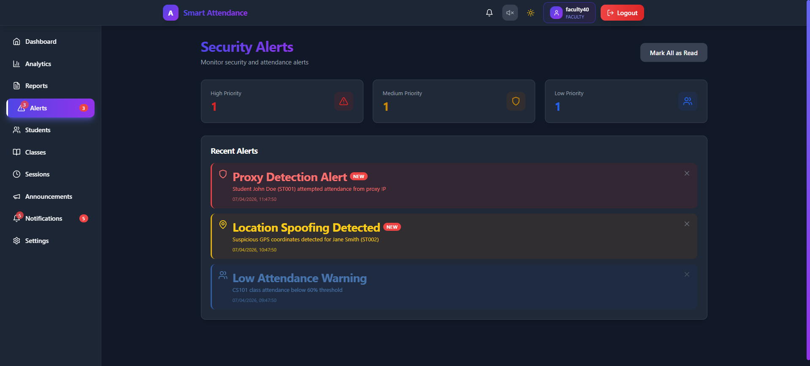
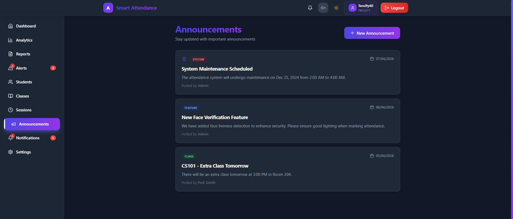
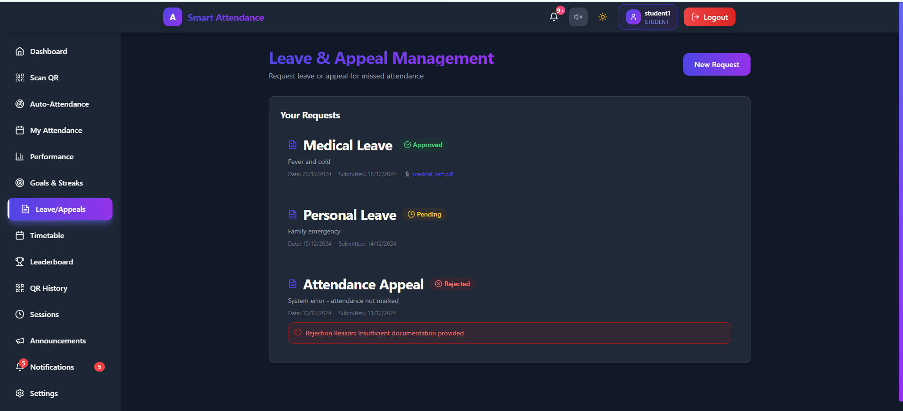
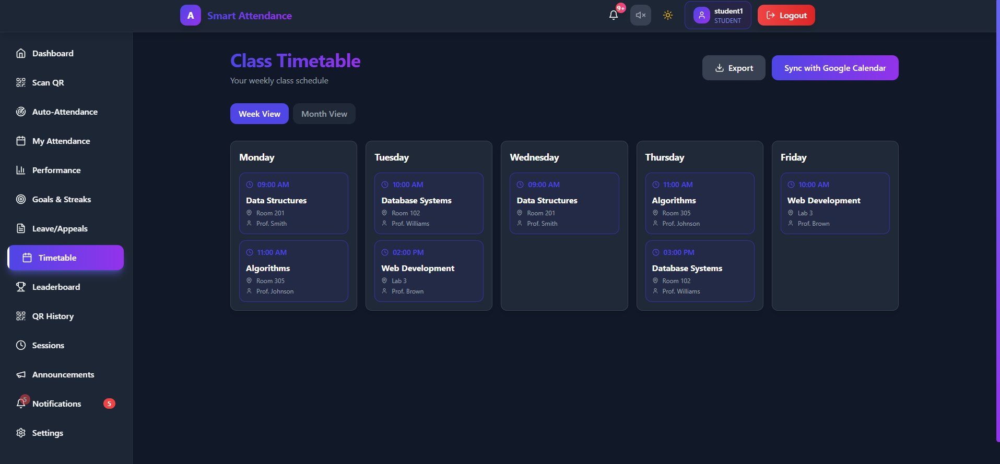
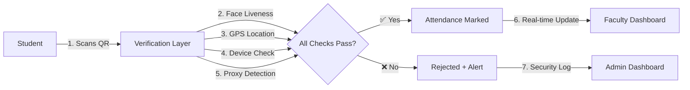

<div align="center">

# 🎓 ProxyMukt

### *Intelligent Attendance System That Eliminates Proxy Attendance*

[](#)
[](LICENSE)
[](#)
[](https://nodejs.org/)
[](https://www.mongodb.com/)

### 🚀 **[Live Demo](https://proxymukt.onrender.com/)** 🚀

[Features](#-features) • [Screenshots](#-screenshots) • [Installation](#-installation) • [Tech Stack](#-tech-stack) • [Documentation](#-documentation)

</div>

---

## 🎯 Quick Access

<div align="center">

### 🌐 **[Try ProxyMukt Live](https://proxymukt.onrender.com/)** 

**Instant Access - No Installation Required!**

| Role | Email | Password |
|:----:|:-----:|:--------:|
| 👑 **Admin** | `admin@proxymukt.com` | `Admin@123` |
| 👨‍🏫 **Faculty** | `faculty1@gmail.com` | `faculty1` |
| 👨‍🎓 **Student** | `student1@gmail.com` | `student1` |

*Experience the full power of multi-layer fraud detection in action!*

</div>

---

## 🎯 Problem Statement

**The Challenge:**
Proxy attendance is a widespread problem in educational institutions where students mark attendance on behalf of absent peers. Traditional systems using manual registers, static QR codes, or simple biometric methods are easily exploited, leading to:

- 📉 Inaccurate attendance records
- 🎭 Identity fraud and impersonation
- 📱 Screenshot sharing of QR codes
- 🌍 Location spoofing with fake GPS apps
- 🔄 Proxy marking through VPNs and proxies

**The Solution:**
ProxyMukt implements a **multi-layered security approach** combining rotating QR codes, face liveness detection, GPS geofencing, device fingerprinting, and advanced proxy detection to create a fraud-proof attendance system that's impossible to bypass.

> 🌐 **Experience it yourself:** [https://proxymukt.onrender.com/](https://proxymukt.onrender.com/)

---

## ✨ Features

### 🔐 **Multi-Layer Security Architecture**

<table>
<tr>
<td width="50%">

#### 🎫 Dynamic QR Authentication
- Rotating QR codes every 20 seconds
- HMAC-SHA256 cryptographic signing
- 100-second validity window
- Session-specific token binding
- Screenshot fraud prevention

</td>
<td width="50%">

#### 👤 Face Liveness Detection
- Real-time movement verification
- Blink and head movement detection
- Anti-spoofing with photo detection
- Privacy-focused (no facial recognition)
- TensorFlow.js powered

</td>
</tr>
<tr>
<td width="50%">

#### 📍 GPS Geofencing
- Configurable radius verification
- Location accuracy validation
- Impossible travel detection
- Distance calculation from session
- Suspicious location flagging

</td>
<td width="50%">

#### 🖥️ Device Fingerprinting
- Unique device signature tracking
- Browser, OS, screen resolution
- Hardware concurrency analysis
- Multi-device detection
- Suspicious pattern identification

</td>
</tr>
<tr>
<td width="50%">

#### 🛡️ Proxy/VPN Detection
- Advanced IP reputation analysis
- Datacenter IP identification
- VPN and proxy detection
- Tor network blocking
- Real-time threat scoring

</td>
<td width="50%">

#### ⚡ Real-Time Updates
- WebSocket integration
- Live attendance feed
- Instant notifications
- Auto-refreshing dashboards
- Session status sync

</td>
</tr>
</table>

### 👥 **Role-Based Dashboards**

#### 👨‍💼 Admin Dashboard
- System-wide analytics and monitoring
- User management (bulk operations)
- Security center with threat detection
- Audit logs and activity tracking
- Department and class management
- IP whitelist configuration

#### 👨‍🏫 Faculty Dashboard
- Class and session management
- Flexible verification controls
- Real-time attendance monitoring
- Student enrollment management
- Performance analytics
- Alert notifications

#### 👨‍🎓 Student Dashboard
- QR code scanning interface
- Attendance history and analytics
- Performance tracking
- Leave/appeal management
- Timetable and schedule
- Achievement badges

### 🎯 **Advanced Features**

- **Session Types**: Offline (QR) and Online (Zoom/Meet/Teams) support
- **Pause/Resume**: Faculty can pause sessions temporarily
- **Dynamic Controls**: Toggle verification methods during live sessions
- **Attendance Goals**: Set targets and track streaks
- **Leaderboards**: Gamification with rankings
- **Reports**: Export attendance data (CSV/PDF)
- **Notifications**: Real-time alerts for all stakeholders
- **Dark Theme**: Modern, eye-friendly UI

---

## 🎬 Live Demo & Screenshots

### 🌐 **Try It Live:** [https://proxymukt.onrender.com/](https://proxymukt.onrender.com/)

**Test Credentials:**
- 👑 Admin: `admin@proxymukt.com` / `Admin@123` 
- 👨‍🏫 Faculty: `faculty1@gmail.com` / `faculty1`
- 👨‍🎓 Student: `student1@gmail.com` / `student1`

> 💡 **Tip:** Try logging in as different roles to experience the complete system!

---

### 📸 Application Screenshots

#### 🏠 Faculty Dashboard

*Real-time session monitoring with live attendance updates, class management, and quick actions*

---

#### 👨‍💼 Admin Dashboard

*Comprehensive system overview with analytics, user management, and security monitoring*

---

#### 👨‍🎓 Student Dashboard

*Student portal with attendance history, performance metrics, and QR scanning*

---

#### 📱 QR Scanning Interface

*Seamless QR code scanning with face liveness and location verification*

---

#### 📅 Live Session Monitoring

*Faculty view of active session with real-time attendance feed and verification status*

---

#### 🚨 Faculty Alerts & Security

*Security alerts for proxy detection, suspicious activity, and low attendance warnings*

---

#### 📢 Announcements System

*System-wide and class-specific announcements with priority levels*

---

#### 📝 Leave Management & Appeals

*Student leave requests and appeals with document upload support*

---

#### 📅 Student Timetable

*Weekly schedule with upcoming sessions and calendar integration*

---

## 🛠️ Tech Stack

### **Frontend**
```
⚛️  React 18              - Modern UI library with hooks
🚀  Vite                  - Lightning-fast build tool
🎨  Tailwind CSS          - Utility-first styling
🎭  Framer Motion         - Smooth animations
🔄  React Router          - Client-side routing
📊  Recharts              - Data visualization
🔌  Socket.IO Client      - Real-time communication
📷  jsQR                  - QR code scanning
🎯  Zustand               - State management
🎨  Lucide React          - Beautiful icons
```

### **Backend**
```
🟢  Node.js               - JavaScript runtime
⚡  Express               - Web framework
🍃  MongoDB               - NoSQL database
🔐  JWT                   - Authentication
🔒  bcryptjs              - Password hashing
🔌  Socket.IO             - WebSocket server
📧  Nodemailer            - Email service
🛡️  Helmet                - Security headers
⏱️  Express Rate Limit    - DDoS protection
```

### **Security & ML**
```
🤖  TensorFlow.js         - Face liveness detection
🔐  HMAC-SHA256           - QR token signing
🛡️  Advanced Proxy Detection
📍  Geolocation API       - GPS verification
🖥️  Device Fingerprinting
🔍  IP Reputation Analysis
```

---

## 📦 Installation

### Prerequisites

Before you begin, ensure you have the following installed:

- **Node.js** (v18 or higher) - [Download](https://nodejs.org/)
- **MongoDB** (v6 or higher) - [Download](https://www.mongodb.com/try/download/community)
- **Git** - [Download](https://git-scm.com/)
- **npm** or **yarn** package manager

### Quick Start

#### 1️⃣ Clone the Repository

```bash
git clone https://github.com/your-repo/ProxyMukt-Attendance-System.git
cd ProxyMukt-Attendance-System
```

#### 2️⃣ Backend Setup

```bash
# Navigate to server directory
cd server

# Install dependencies
npm install

# Create environment file
cp .env.example .env

# Edit .env with your configuration
# Required: MONGODB_URI, JWT_SECRET
# Optional: ZOOM credentials, Email service

# Seed database with sample data
npm run seed

# Start development server
npm run dev
```

**Server will run on:** `http://localhost:5000`

#### 3️⃣ Frontend Setup

```bash
# Navigate to client directory (from root)
cd client

# Install dependencies
npm install

# Create environment file
cp .env.example .env

# Edit .env with API URL
# VITE_API_URL=http://localhost:5000/api

# Start development server
npm run dev
```

**Client will run on:** `http://localhost:5173`

### 🔧 Environment Configuration

<details>
<summary><b>Server Environment Variables (.env)</b></summary>

```env
# Server Configuration
NODE_ENV=development
PORT=5000

# Database
MONGODB_URI=mongodb://localhost:27017/proxymukt

# JWT Authentication
JWT_SECRET=your_super_secret_jwt_key_here_change_in_production
JWT_EXPIRE=7d

# Client URL (for CORS)
CLIENT_URL=http://localhost:5173

# Admin Credentials (for seeding)
ADMIN_EMAIL=admin@proxymukt.com
ADMIN_PASSWORD=Admin@123

# Optional: Zoom Integration
ZOOM_ACCOUNT_ID=your_zoom_account_id
ZOOM_CLIENT_ID=your_zoom_client_id
ZOOM_CLIENT_SECRET=your_zoom_client_secret

# Optional: Email Service (for notifications)
EMAIL_HOST=smtp.gmail.com
EMAIL_PORT=587
EMAIL_USER=your_email@gmail.com
EMAIL_PASS=your_app_specific_password
EMAIL_FROM=ProxyMukt <noreply@proxymukt.com>
```

</details>

<details>
<summary><b>Client Environment Variables (.env)</b></summary>

```env
# API Configuration
VITE_API_URL=http://localhost:5000/api

# Optional: Analytics
VITE_ENABLE_ANALYTICS=false
```

</details>

### 🎯 Default Login Credentials

After running `npm run seed`, use these credentials:

| Role | Email | Password |
|------|-------|----------|
| 👑 **Admin** | admin@proxymukt.com | Admin@123 |
| 👨‍🏫 **Faculty** | faculty1@gmail.com | faculty1 |
| 👨‍🎓 **Student** | student1@gmail.com | student1 |

*Note: Faculty and students are numbered 1-50 and 1-500 respectively*

---

## 🎯 How It Works

### 📋 System Flow



### 🔄 Detailed Workflow

#### **For Faculty:**

1. **Create Class** → Add class details and enroll students
2. **Start Session** → Choose type (Offline/Online) and configure verification methods
3. **Monitor Live** → View real-time attendance feed with student names
4. **Manage Session** → Pause/resume, toggle QR, adjust verification settings
5. **End Session** → Close session and review analytics

#### **For Students:**

1. **Scan QR Code** → Use camera to scan faculty's rotating QR code
2. **Face Verification** → Complete liveness check (blink/move head)
3. **Location Check** → Confirm presence at session location
4. **Background Checks** → System validates device, IP, and proxy status
5. **Attendance Confirmed** → Receive instant confirmation and notification

#### **Security Validation:**

```
┌─────────────────────────────────────────────────────┐
│  Multi-Layer Security Validation                    │
├─────────────────────────────────────────────────────┤
│  ✓ QR Token Signature (HMAC-SHA256)                │
│  ✓ Token Expiry (100 seconds)                      │
│  ✓ Session Binding                                 │
│  ✓ Face Liveness (if enabled)                      │
│  ✓ GPS Distance (if enabled)                       │
│  ✓ Device Fingerprint Match                        │
│  ✓ IP Reputation Score                             │
│  ✓ Proxy/VPN Detection                             │
│  ✓ Impossible Travel Check                         │
│  ✓ Rate Limit Validation                           │
└─────────────────────────────────────────────────────┘
```

---

## 📁 Project Structure

```
ProxyMukt-Attendance-System/
│
├── 📂 client/                      # React Frontend Application
│   ├── 📂 public/                  # Static assets
│   │   ├── logo.svg
│   │   └── _redirects              # Netlify/Vercel redirects
│   │
│   ├── 📂 src/
│   │   ├── 📂 components/          # Reusable UI components
│   │   │   ├── Navbar.jsx
│   │   │   ├── Sidebar.jsx
│   │   │   ├── FaceVerification.jsx
│   │   │   ├── QRDisplay.jsx
│   │   │   ├── AnalyticsCharts.jsx
│   │   │   └── ...
│   │   │
│   │   ├── 📂 pages/               # Page components
│   │   │   ├── AdminDashboard.jsx
│   │   │   ├── FacultyDashboard.jsx
│   │   │   ├── StudentDashboard.jsx
│   │   │   ├── StartSession.jsx
│   │   │   ├── ScanQR.jsx
│   │   │   └── ...
│   │   │
│   │   ├── 📂 store/               # Zustand state management
│   │   │   ├── authStore.js
│   │   │   └── sessionStore.js
│   │   │
│   │   ├── 📂 utils/               # Utility functions
│   │   │   ├── axiosInstance.js
│   │   │   ├── deviceFingerprint.js
│   │   │   └── voiceAnnouncements.js
│   │   │
│   │   ├── App.jsx                 # Main app component
│   │   ├── main.jsx                # Entry point
│   │   └── index.css               # Global styles
│   │
│   ├── package.json
│   ├── vite.config.js
│   └── tailwind.config.js
│
├── 📂 server/                      # Node.js Backend Application
│   ├── 📂 src/
│   │   ├── 📂 config/              # Configuration files
│   │   │   ├── db.js               # MongoDB connection
│   │   │   └── constants.js        # App constants
│   │   │
│   │   ├── 📂 controllers/         # Business logic
│   │   │   ├── authController.js
│   │   │   ├── sessionController.js
│   │   │   ├── attendanceController.js
│   │   │   ├── analyticsController.js
│   │   │   └── ...
│   │   │
│   │   ├── 📂 middleware/          # Custom middleware
│   │   │   ├── auth.js             # JWT authentication
│   │   │   ├── role.js             # Role-based access
│   │   │   ├── advancedSecurity.js # Fraud detection
│   │   │   ├── rateLimitMiddleware.js
│   │   │   └── ...
│   │   │
│   │   ├── 📂 models/              # Mongoose schemas
│   │   │   ├── User.js
│   │   │   ├── Class.js
│   │   │   ├── Session.js
│   │   │   ├── Attendance.js
│   │   │   └── ...
│   │   │
│   │   ├── 📂 routes/              # API routes
│   │   │   ├── authRoutes.js
│   │   │   ├── sessionRoutes.js
│   │   │   ├── attendanceRoutes.js
│   │   │   └── ...
│   │   │
│   │   ├── 📂 utils/               # Utility functions
│   │   │   ├── advancedProxyDetection.js
│   │   │   ├── clientFingerprinting.js
│   │   │   ├── emailService.js
│   │   │   └── cache.js
│   │   │
│   │   └── server.js               # Server entry point
│   │
│   ├── package.json
│   ├── seed.js                     # Database seeding script
│   └── .env.example
│
├── 📂 screenshots/                 # Project screenshots
│   ├── AdminDashboard.png
│   ├── FacultyDashboard.png
│   ├── StudentDashboard.png
│   └── ...
│
├── render.yaml                     # Render.com deployment config
├── .gitignore
├── LICENSE
└── README.md
```

---

## 📚 API Documentation

### 🔐 Authentication Endpoints

<details>
<summary><b>POST /api/auth/register</b> - Register new user</summary>

**Request Body:**
```json
{
  "name": "John Doe",
  "email": "john@example.com",
  "password": "SecurePass123",
  "role": "STUDENT",
  "studentId": "STU001",
  "department": "Computer Science"
}
```

**Response:**
```json
{
  "success": true,
  "message": "User registered successfully",
  "data": {
    "user": { "id": "...", "name": "John Doe", "role": "STUDENT" },
    "token": "eyJhbGciOiJIUzI1NiIsInR5cCI6IkpXVCJ9..."
  }
}
```

</details>

<details>
<summary><b>POST /api/auth/login</b> - User login</summary>

**Request Body:**
```json
{
  "email": "john@example.com",
  "password": "SecurePass123"
}
```

**Response:**
```json
{
  "success": true,
  "data": {
    "user": { "id": "...", "name": "John Doe", "role": "STUDENT" },
    "token": "eyJhbGciOiJIUzI1NiIsInR5cCI6IkpXVCJ9..."
  }
}
```

</details>

### 📅 Session Endpoints

<details>
<summary><b>POST /api/sessions</b> - Create new session</summary>

**Request Body:**
```json
{
  "classId": "class_id_here",
  "title": "Data Structures - Lecture 5",
  "date": "2025-04-07T10:00:00Z",
  "sessionType": "OFFLINE",
  "qrEnabled": true,
  "verificationRequirements": {
    "qrCode": true,
    "faceVerification": true,
    "locationVerification": true
  },
  "location": {
    "latitude": 28.6139,
    "longitude": 77.2090,
    "radius": 100
  }
}
```

</details>

<details>
<summary><b>GET /api/sessions/:id/qr</b> - Get QR token</summary>

**Response:**
```json
{
  "success": true,
  "data": {
    "qrToken": "signed_hmac_token_here",
    "expiresAt": "2025-04-07T10:01:40Z"
  }
}
```

</details>

### ✅ Attendance Endpoints

<details>
<summary><b>POST /api/attendance/mark</b> - Mark attendance</summary>

**Request Body:**
```json
{
  "qrToken": "signed_token_from_qr",
  "location": {
    "latitude": 28.6140,
    "longitude": 77.2091,
    "accuracy": 10
  },
  "deviceInfo": {
    "userAgent": "Mozilla/5.0...",
    "deviceFingerprint": "unique_device_id"
  },
  "faceVerificationPassed": true
}
```

</details>

### 📊 Analytics Endpoints

<details>
<summary><b>GET /api/analytics/section?section=all</b> - Get analytics</summary>

**Response:**
```json
{
  "success": true,
  "data": {
    "overview": {
      "totalClasses": 50,
      "totalSessions": 400,
      "avgAttendance": 85.5
    },
    "trends": [...],
    "topPerformers": [...]
  }
}
```

</details>

---

## 🚀 Deployment

### 🌐 Live Production Instance

**ProxyMukt is live at:** [https://proxymukt.onrender.com/](https://proxymukt.onrender.com/)

The application is deployed on Render.com with:
- ✅ Automatic SSL/HTTPS
- ✅ MongoDB Atlas database
- ✅ Environment-based configuration
- ✅ Auto-deploy on GitHub push
- ✅ Health monitoring

---

### Deploy Your Own Instance

#### Deploy to Render.com (Recommended)

1. **Push to GitHub**
   ```bash
   git add .
   git commit -m "Ready for deployment"
   git push origin main
   ```

2. **Connect to Render**
   - Go to [Render Dashboard](https://dashboard.render.com/)
   - Click "New +" → "Blueprint"
   - Connect your GitHub repository
   - Render will auto-detect `render.yaml`

3. **Configure Environment Variables**
   - Add all required environment variables in Render dashboard
   - Set `NODE_ENV=production`
   - Configure MongoDB Atlas URI

4. **Deploy**
   - Render will automatically build and deploy
   - Get your live URL: `https://your-app.onrender.com`

### Deploy to Vercel/Netlify (Frontend)

```bash
cd client
npm run build

# Deploy dist/ folder to Vercel or Netlify
```

### Manual Production Deployment

```bash
# Build frontend
cd client
npm run build

# Start production server
cd ../server
NODE_ENV=production npm start
```

---

## 🧪 Testing

### Run Tests

```bash
# Backend unit tests
cd server
npm test

# Frontend component tests
cd client
npm test

# E2E tests
npm run test:e2e
```

### Test Coverage

```bash
npm run test:coverage
```

---

## 🤝 Contributing

We welcome contributions! Here's how you can help:

### 1️⃣ Fork & Clone

```bash
# Fork the repository on GitHub
# Then clone your fork
git clone https://github.com/YOUR_USERNAME/ProxyMukt-Attendance-System-.git
```

### 2️⃣ Create Branch

```bash
git checkout -b feature/AmazingFeature
```

### 3️⃣ Make Changes

- Write clean, documented code
- Follow existing code style
- Add tests for new features
- Update documentation

### 4️⃣ Commit & Push

```bash
git add .
git commit -m "Add: Amazing new feature"
git push origin feature/AmazingFeature
```

### 5️⃣ Open Pull Request

- Go to your fork on GitHub
- Click "New Pull Request"
- Describe your changes
- Wait for review

### 📋 Contribution Guidelines

- Follow [Conventional Commits](https://www.conventionalcommits.org/)
- Write meaningful commit messages
- Add tests for new features
- Update README if needed
- Be respectful and collaborative

---

## 📄 License

This project is licensed under the **MIT License** - see the [LICENSE](LICENSE) file for details.

```
MIT License

Copyright (c) 2025 Capstone Project | Department of CSE

Permission is hereby granted, free of charge, to any person obtaining a copy
of this software and associated documentation files (the "Software"), to deal
in the Software without restriction, including without limitation the rights
to use, copy, modify, merge, publish, distribute, sublicense, and/or sell
copies of the Software, and to permit persons to whom the Software is
furnished to do so, subject to the following conditions:

The above copyright notice and this permission notice shall be included in all
copies or substantial portions of the Software.
```

---

## 👨‍💻 Development Team

<div align="center">

### **Capstone Project | Department of CSE**

[](#)
[](#)
[](#)

*Computer Science Engineering Department Project*

</div>

---

## 🙏 Acknowledgments

Special thanks to:

- **TensorFlow.js** team for face detection models
- **Socket.IO** for real-time communication
- **MongoDB** for flexible database solutions
- **React** and **Vite** communities
- **Tailwind CSS** for beautiful styling
- All open-source contributors

### Technologies & Libraries

- QR Code generation using `crypto` HMAC-SHA256
- Face liveness detection with TensorFlow.js
- Real-time updates powered by Socket.IO
- UI components inspired by Shadcn/ui
- Icons from Lucide React
- Charts from Recharts

---

## 📞 Support

Need help? We're here for you!

- 🌐 **Live Demo**: [https://proxymukt.onrender.com/](https://proxymukt.onrender.com/)
- 📧 **Email**: [sumantyadav3086@gmail.com](mailto:sumantyadav3086@gmail.com)
- 🐛 **Issues**: [GitHub Issues](https://github.com/Sumant3086/ProxyMukt-Attendance-System-/issues)
- 💬 **Discussions**: [GitHub Discussions](https://github.com/Sumant3086/ProxyMukt-Attendance-System-/discussions)
- 📖 **Documentation**: [Wiki](https://github.com/Sumant3086/ProxyMukt-Attendance-System-/wiki)

---

## 🔄 Version History

### 🎉 v2.0.0 (Current - April 2025)

**Major Features:**
- ✅ Multi-layer fraud detection system
- ✅ Real-time WebSocket updates
- ✅ Faculty-controlled verification methods
- ✅ Advanced analytics dashboard
- ✅ Dark theme UI with animations
- ✅ Student enrollment management
- ✅ Pause/resume session functionality
- ✅ Online session support (Zoom/Meet/Teams)
- ✅ Leave and appeal management
- ✅ Attendance goals and streaks
- ✅ Production deployment ready

**Security Enhancements:**
- 🔒 HMAC-SHA256 QR token signing
- 🔒 Advanced proxy/VPN detection
- 🔒 Device fingerprinting
- 🔒 Impossible travel detection
- 🔒 Rate limiting and DDoS protection

### 📦 v1.0.0 (Initial Release)

- Basic QR code attendance
- Simple authentication
- Manual attendance marking
- Basic reporting

---

## 🗺️ Roadmap

### 🎯 Upcoming Features

- [ ] **Mobile Apps** (React Native)
- [ ] **Biometric Authentication** (Fingerprint/Face ID)
- [ ] **AI-Powered Insights** (Predictive analytics)
- [ ] **Blockchain Integration** (Immutable attendance records)
- [ ] **Multi-Language Support** (i18n)
- [ ] **Offline Mode** (PWA with sync)
- [ ] **Parent Portal** (Real-time notifications)
- [ ] **Integration APIs** (LMS, ERP systems)
- [ ] **Advanced Reporting** (Custom report builder)
- [ ] **Video Proctoring** (For online exams)

---

## 📊 Project Stats

<div align="center">


</div>

---

<div align="center">

### ⭐ Star this repository if you find it helpful!

**Made with ❤️ for educational institutions worldwide**

*Eliminating proxy attendance, one scan at a time* 🎓

---

**[⬆ Back to Top](#-proxymukt)**

</div>
